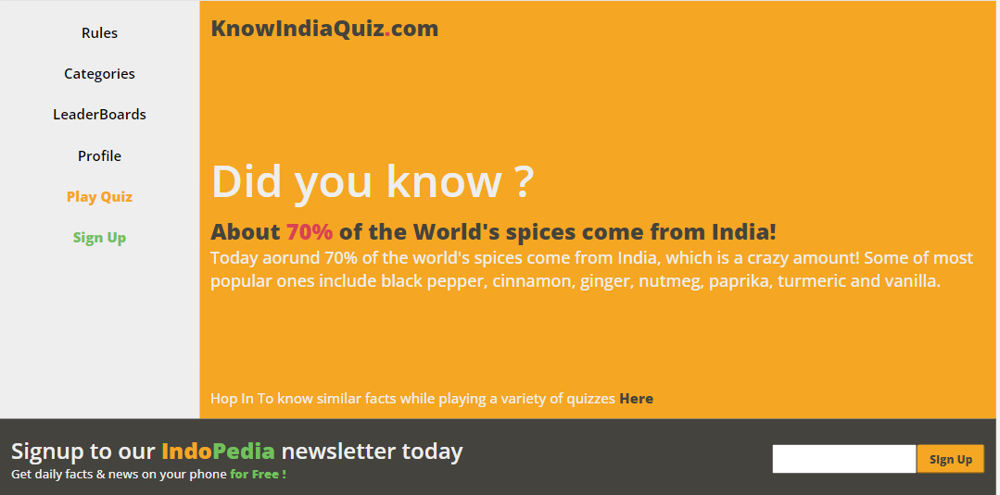
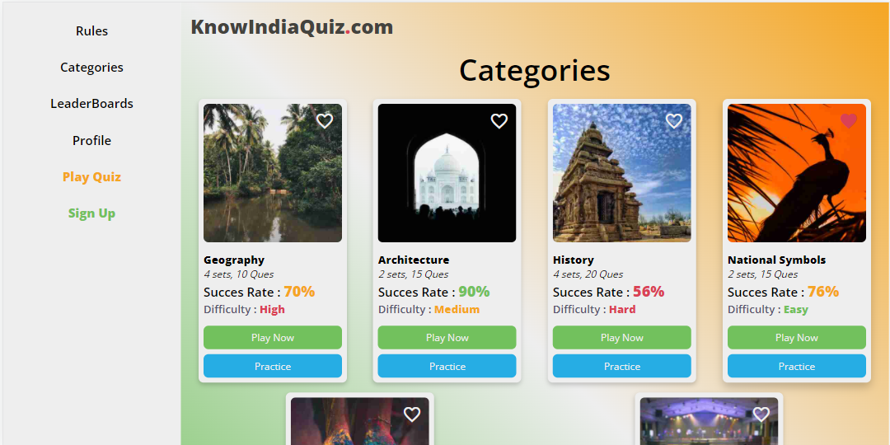
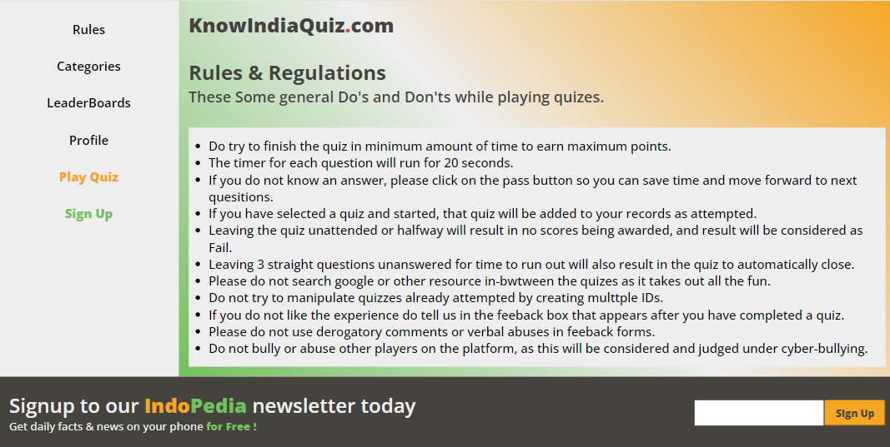
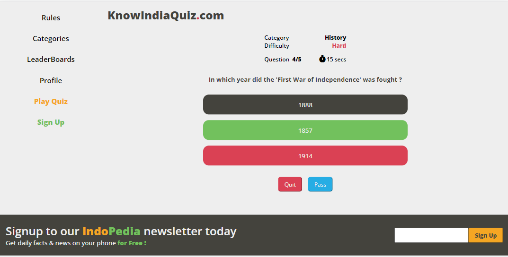
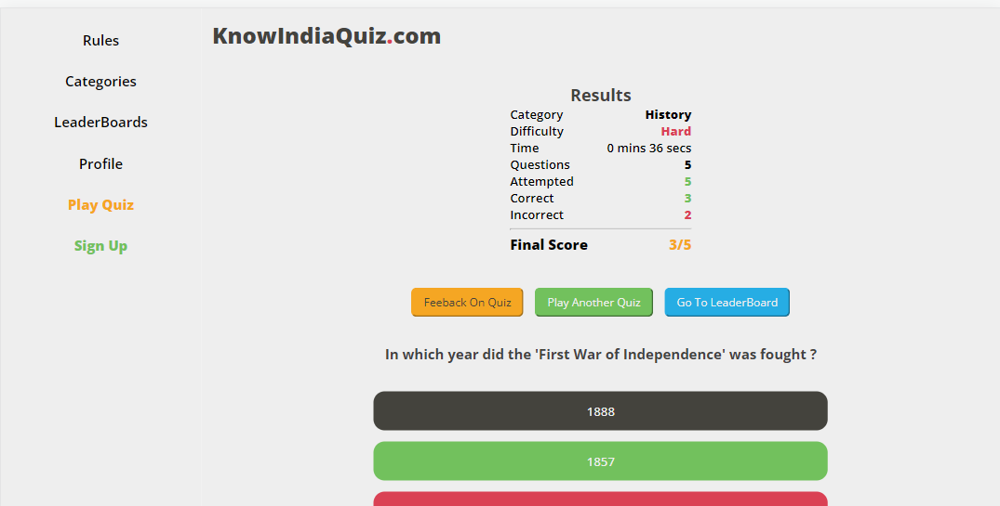

# KnowIndia

### Disclaimer

The current application is still a WIP (work in progress) and hence all the functions may or may not work in the intended manner.     
At current stage only static (HTML, CSS & JS) templates have been developed for the respective components/pages.     

### Live Project Link 
#### Vercel : https://know-india-git-development-hnh013.vercel.app/
#### Netlify : https://knowindiaquiz.netlify.app/

## Contents

1. **[Project Title & description](#knowIndia)**
2. **[Purpose of the project](#purpose-of-the-project)**
3. **[Technologies Used](#technologies-used)**
4. **[Motivations behind the project](#motivations-behind-the-project)**
5. **[Demo](#demo)**

## 1. KnowIndia
* KnowIndia is online web based quiz application mainly focussed on online questionnaire based structure where users answer a series of questions within a timeframe and earn points.
* The application will offer its users to play different categories of quizes based on our country India.   
* Users would be earn points, get a rank and get shown on leaderboards
* Users will be able to create account , login and logout from the application via an authentication system.

At this moment, current list of components/pages that are present in the application are :

1. Home Page [Link](https://knowindiaquiz.netlify.app/index.html)
2. Rules Page [Link](https://knowindiaquiz.netlify.app/components/rules.html)
3. Category Page [Link](https://knowindiaquiz.netlify.app/components/category.html)
4. Question Page [Link](https://knowindiaquiz.netlify.app/components/question.html)
5. Result Page [Link](https://knowindiaquiz.netlify.app/components/result.html)

## 2. Purpose of the project
* The main aim of the project is to create a user-friendly, easily to navigate and fun quiz environment for the players.
* The leaderboards and rank system is there to ensure a sense of competitiveness between the players. 

## 3. Technologies Used
* At the current stage of development, HTML , CSS and vanilla JS have been used in the project.

## 4. Motivations behind the project
* This project was built as part of my learning in neogcamp 2022.
* The project also hopes make the people aware of various facts and figures and other information about our country India in a fun and competitive way.

## 5. Demo

### The project is live at 
#### Vercel : https://know-india-git-development-hnh013.vercel.app/
#### Netlify : https://knowindiaquiz.netlify.app

#### Home Page [Link](https://knowindiaquiz.netlify.app/index.html)

#### Category Page [Link](https://knowindiaquiz.netlify.app/components/category.html)

#### Rules Page [Link](https://knowindiaquiz.netlify.app/components/rules.html)

#### Question Page [Link](https://knowindiaquiz.netlify.app/components/question.html)

#### Result Page [Link](https://knowindiaquiz.netlify.app/components/result.html)

[Back To Top](#top)
